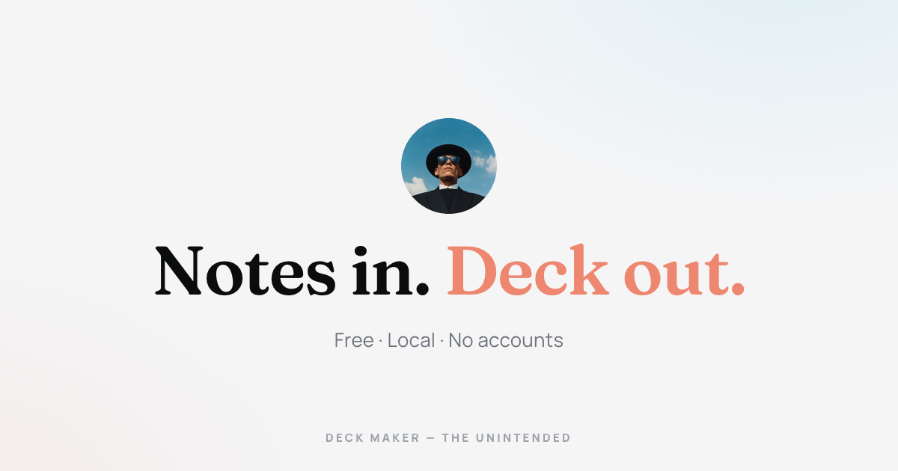

<p align="center">
  <a href="https://theunintended.me"></a>
</p>

<h1 align="center">Deck Maker</h1>

<p align="center">
  <b>Notes in. Deck out.</b><br />
  Drop Markdown, a PowerPoint, a PDF, or just describe it in a sentence.<br />
  Get back a deck with your brand on it.
</p>

<p align="center">
  <a href="https://github.com/DrStylidis/deck-maker-app/releases/latest"></a>
  
  <a href="https://theunintended.me"></a>
</p>

<p align="center">
  <a href="https://github.com/DrStylidis/deck-maker-app/releases/latest/download/Deck-Maker-arm64.dmg"></a>
  <a href="https://github.com/DrStylidis/deck-maker-app/releases/latest/download/Deck-Maker-x64.dmg"></a>
  <a href="https://github.com/DrStylidis/deck-maker-app/releases/latest/download/Deck-Maker-x64.exe"></a>
  <a href="https://github.com/DrStylidis/deck-maker-app/releases/latest/download/Deck-Maker-x86_64.AppImage"></a>
</p>

<p align="center">
  <a href="https://theunintended.me"></a>
</p>

---

## What it does

- 📝 **Any input** — Markdown notes (draft them in Claude or ChatGPT first if you like), an old `.pptx`, a `.pdf`, or a single sentence describing the deck you want.
- 🎨 **StyleMaker** — point it at your website and it lifts the palette, typography, and logo into a reusable Style. Every future deck starts on brand.
- 🖱️ **Every element editable** — click anything on the canvas and change it: text, layout, images, styling. The AI gives you a starting deck, not a locked one.
- 📤 **Real exports** — a print-clean PDF, a genuinely editable PPTX, or a self-contained website you can host anywhere.
- 🔑 **Bring your own AI** — your key for Anthropic, OpenAI, or xAI Grok, or a local model and fully offline. Keys live in your system keychain.
- 🔒 **Local-first** — your decks are files on your disk, not rows in someone's database. No account, no sync, no seat to renew.
- 🍌 **Nano Banana Pro** — generate slide art from inside the app. Prepaid credit packs, only if you want it.
- 🔄 **Auto-updates** — new versions install themselves from these releases. You'll never download an installer twice.

## How it works

```
1. quarterly-notes.md  ──▶  drop it in
2. intendedfuture.ai   ──▶  StyleMaker scrapes your brand
3. deck comes back     ──▶  styled, editable, ready to present
```

More at **[theunintended.me](https://theunintended.me)** · [Why this exists](https://theunintended.me/why.html) · [FAQ](https://theunintended.me/faq.html)

## Download

| Platform | Download |
|---|---|
| macOS 11+ (Apple Silicon) | [`Deck-Maker-arm64.dmg`](https://github.com/DrStylidis/deck-maker-app/releases/latest/download/Deck-Maker-arm64.dmg) — signed & notarized |
| macOS 11+ (Intel) | [`Deck-Maker-x64.dmg`](https://github.com/DrStylidis/deck-maker-app/releases/latest/download/Deck-Maker-x64.dmg) — signed & notarized |
| Windows 10/11 (x64) | [`Deck-Maker-x64.exe`](https://github.com/DrStylidis/deck-maker-app/releases/latest/download/Deck-Maker-x64.exe) — unsigned for now, SmartScreen may warn |
| Linux (x64) | [`Deck-Maker-x86_64.AppImage`](https://github.com/DrStylidis/deck-maker-app/releases/latest/download/Deck-Maker-x86_64.AppImage) |

[All releases →](https://github.com/DrStylidis/deck-maker-app/releases)

## Privacy

Deck Maker sends three anonymous events — app launched, deck created, deck exported — with the app version and OS. Never your content, prompts, or keys; IP addresses are not stored. Off switch in **Settings → Privacy**. Full policy: [theunintended.me/privacy](https://theunintended.me/privacy.html).

## About this repo

This repository hosts the **landing page, release builds, and auto-update manifests**. The application source is maintained privately.

<p align="center">
  Free · Local · No accounts<br />
  Made by <b>The Unintended</b> · <a href="https://www.intendedfuture.ai/">Intended Future</a>
</p>
